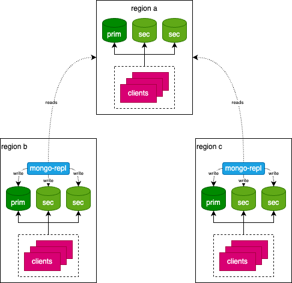

# Mongo Replication

This repository contains a replication tool for MongoDB databases. The goals of this tool
are to keep two MongoDB databases, one source and one target, synchronized.
It is as the moment a proof of concept inspired by [MongoShake](https://github.com/alibaba/MongoShake).

## Rationale

The objective I have here is to implement a lightweight and fail-safe replication mechanism between
differents datacenters and remove the requirements from native MongoDB replication to have all the nodes
to know each other.

MongoDB comes with a great native replication mechanism inside a ReplicaSet. It is possible to deploy a ReplicaSet on multiple regions/datacenters with excellent replication delay and network fault tolerance. But this topology also comes with a constraint I need to get ride off. This constraint implies that all your nodes are always visible nonetheless between them, but also from the clients that connect to MongoDB. See [server discovery and monitoring](https://github.com/mongodb/specifications/blob/master/source/server-discovery-and-monitoring/server-discovery-and-monitoring.md) for more details.

To solve this, the idea to deploy different ReplicaSet on datacenters/regions and keep them synchronized using
`mongo-repl`. The way `mongo-repl` can read the source cluster is not covered here. However in my use-case, there is a point-to-point tunnel using tailscale. All MongoDB nodes are on a private subnet.



## Features

- Initial idempotent full sync (update if data already exists)
- Always running. The service, once started, keep on synching source and target
- Kubernetes ready using `/status` liveness endpoint
- Configure collections white list or black list (exclusive)
- QPS limiter applied at the source (not yet configurable)
- Prometheus reporting using `/metrics` endpoint

## Planned

- OPLog replay
- CLI mode to do a oneshot full sync
- Control API to pause/resume and trigger snapshots

## Not planned

- Support of MongoDB shards

## Usage

The tool fetch its configuration from a local `yaml` file. A sample if provided
in the `/conf` directory. The env variable `CONFIG_FILE_PATH` is used to pass the
path to the configuration file at start. See [config](./docs/config.md).

Run from command-line:

Run container:

```
docker run -it --rm \
-p 3000:3000 \
--mount type=bind,source=/path/to/config.yaml,target=/app/conf.yaml,readonly \
--env-file /path/to/.env \
sebastienferry/mongo-repl:v0.0.8
```

## Contributions

This project is not yet open to contributions. This might change in the future
once the very basic features would have been implemented.